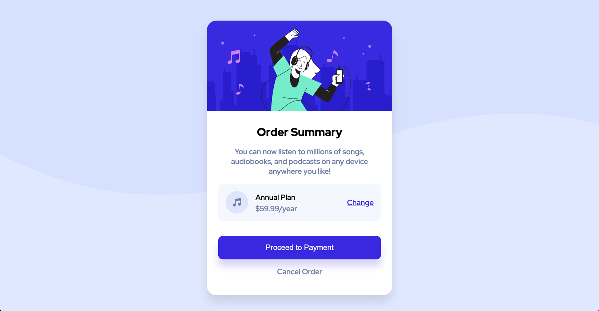

# Frontend Mentor - Order summary card solution

This is a solution to the [Order summary card challenge on Frontend Mentor](https://www.frontendmentor.io/challenges/order-summary-component-QlPmajDUj). Frontend Mentor challenges help you improve your coding skills by building realistic projects. 

## Table of contents

- [Overview](#overview)
  - [The challenge](#the-challenge)
  - [Screenshot](#screenshot)
  - [Links](#links)
- [My process](#my-process)
  - [Built with](#built-with)
  - [What I learned](#what-i-learned)
  - [Continued development](#continued-development)
  - [Useful resources](#useful-resources)
- [Author](#author)

## Overview

### The challenge

Users should be able to:

- See hover states for interactive elements
- Have page respond to different screen sizes

### Screenshot

### Links

- Solution URL: [Solution](https://www.frontendmentor.io/solutions/order-summary-component-used-flexbox-deployed-with-npm-ghpages-Ych84vvvz)
- Live Site URL: [Live Site](https://chriskorsak.github.io/order-summary-component-main/)

## My process

### Built with

- HTML5
- CSS
- Flexbox
- Mobile-first workflow

### What I learned

I learned that I need more practice developing a website from a jpg design mockup file! It's great practice to see something and then code it to match.

### Continued development

I am going to continue developing with a mobile-first approach to CSS.

### Useful resources

- [Flexbox Guide](https://css-tricks.com/snippets/css/a-guide-to-flexbox/) - I almost always consult CSS Tricks guide to flexbox when using this layout method.
- [GH-Pages Package](https://www.npmjs.com/package/gh-pages) - Helpful to deploy to github pages.

## Author

- Website - [Chris Korsak](https://www.chriskorsak.net)
- Frontend Mentor - [@chriskorsak](https://www.frontendmentor.io/profile/chriskorsak)